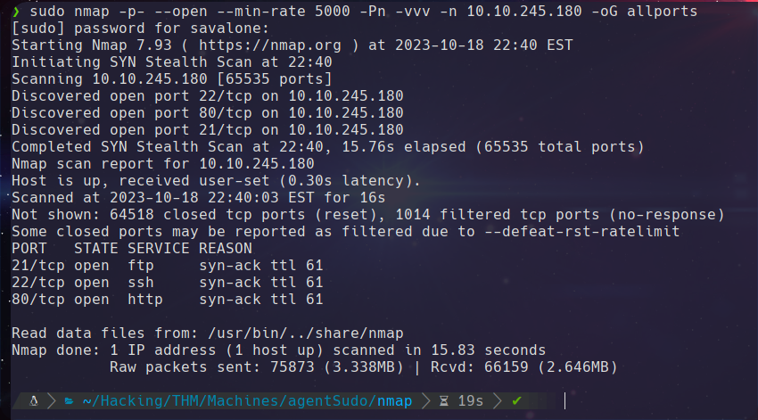
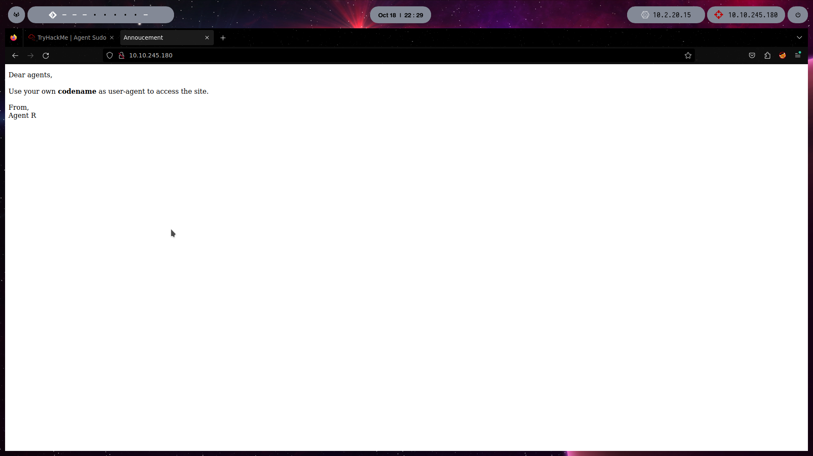
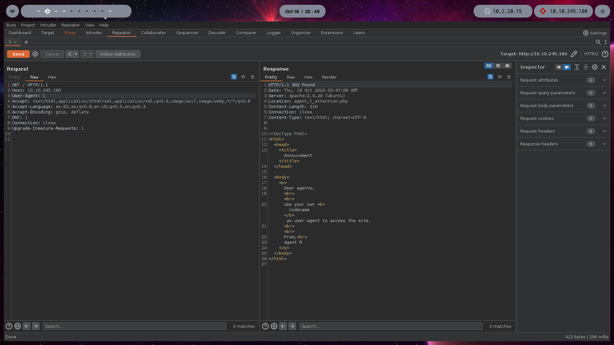
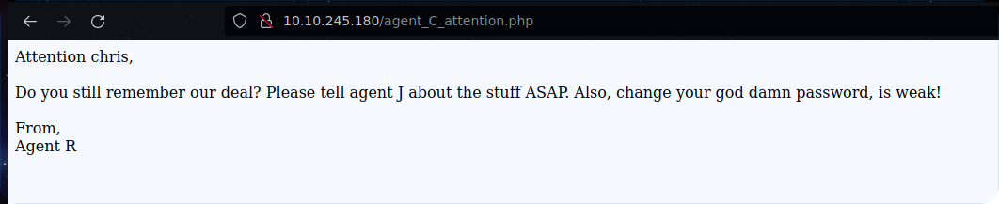

Hola!! en este articulo veremos el CTF Agent Sudo de Tryhackme. hago este walkthrough para poder tener un recuento de los conocimientos que voy adquiriendo en los CTF de tryhackme, y para poder compartir ese conocimiento. Adentrate conmigo en este room, intentare explicarte los conceptos mientras voy resolviendo el desafio.

# Task 1

Preguntas: 

1. Deploy the machine
 
> Respuesta: No answer needed! 

# Task 2

Enumerate the machine and get all the important information

preguntas:
* * *
### 1. Cuantos puertos estan abiertos?

para esto haremos un escaneo de puertos con la herramienta nmap, en mi caso usare los siguientes argumentos `nmap -p- --open --min-rate 5000 -n -Pn -vvv 10.10.245.180 -oG allports`.

 * El parametro -p- se usa para escanear todo el rango de puertos
 * El parametro --open se usa para que se muestre solamente los puertos abiertos
 * --min-rate 5000 se usa para indicar que quiero mandar paquetes no mas lento de 5000 paquetes por segundo
 * El parametro -n se usa para indicar que no usara resolucion de nombre
 * El parametro -Pn para saltar el host discovery
 * El parametro -vvv para aplicar un triple verbose, lo cual nos muestra los puertos a medida de que va descubriendolos
* Y el parametro -oG para exportar el escaneo en formato grepeable a un archivo llamado allports

con esto ya podremos responder la primera pregunta:
> Respuesta: 3
* * *

### 2. Como te puedes redirigir a la pagina secreta?

veamos un poco lo que descubrimmos en el escaneo de puertos.

vemos que hay un puerto 80, veamos si hay algo interesante.

Como podemos ver ya tenemos la respuesta a la siguiente pregunta, la pagina nos dice que para acceder al sitio debemos usar nuestro propio **codename** en el user-agent.

> Respuesta: user-agent

* * *

### 3. Cual es el nombre del agente?

Cambiemos nuestro user-agent!

para esto usaremos burpsuite.

vemos que el que envio el mensaje es el agente **K** asi que intentare con los nombres de agente A, B, C, D...... y asi sucesivamente.

al ir probando con diferentes nombres, al usar el user-agent: C, pude ver una respuesta diferente del sitio web.

aqui tenemos nuestra respuesta, el agente se llama **chris**!!
> Respuesta: chris
