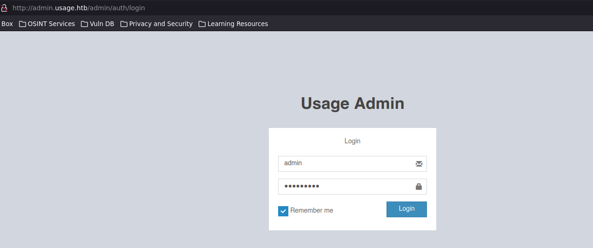

En esta publicacion resolviendo la maquina **Usage** de **Hackthebox**.
<br><br>

* * *
<br><br>

## [](#Recon)Reconocimiento
<br>
En esta primera parte estaremos aplicando un escaneo de puertos abiertos con la herramienta **nmap**, esto nos permitira encontrar servicios expuestos y posibles vulnerabilidades.<br>

<br>
<br>
Encontramos que hay 2 puertos abiertos, el puerto 80, lo que nos indica que hay un servicio web corriendo, y el puerto 22 que es ssh.

Ahora lanzare una serie de scripts basicos de reconocimiento para detectar la version y servicio que corre bajo cada uno de estos puertos.


Se puede ver como no se siguio la redireccion a http://usage.htb/ esto es por que debemos agregar el nombre de la maquina a nuestro archivo /etc/hosts para que resuelva a esa direccion.
<br><br><br>

* * *
<br><br>
## [](#website)Exploracion del sitio web
<br>

En este punto le dare un vistaso al sitio web.


Con la herramienta **whatweb** podemos obtener un poco mas de informacion util acerca de la pagina web.


Aqui encontre algo inusual, **laravel**, investigando un poco vi que **laravel** es un framework de php bastante utilizado.

Investigando un poco mas sobre **laravel**, encontre esta pagina: [https://nvd.nist.gov/vuln/detail/CVE-2021-21263](https://nvd.nist.gov/vuln/detail/CVE-2021-21263). Lo que me indica que hay una posible **SQL injection**.
<br><br>

Bingo! despues de un rato buscando por la pagina, encontre que en el campo de recuperar contrasena se acontece la inyeccion. 

.
<br><br><br>
* * *
<br><br>

## [](#Explotacion)Explotacion
<br>

Sabiendo donde se acontece la inyeccion sql, usare la herramienta **sqlmap** para llevar a cabo la explotacion.
<br><br><br>

Primero interceptare la peticion para saber exactamente cual es el campo vulnerable.


Ahora guardare la peticion en un archivo, y la usare con la herramienta **sqlmap** para automatizar el proceso.

```bash
sqlmap -r request.txt -p email --batch --risk 3 --level 5 --dbs --threads 10
```


vemos una base de datos llamada usage_blog.

Sigamos enumerando esa base de datos:

```bash
sqlmap -r request.txt -p email --batch --risk 3 --level 5 --dbms=mysql --threads 10 --dump -D usage_blog
```
<br><br>


Perfecto!! conseguimos un hash y un username, ahora solo debemos crackear el hash para obtener la contrasena.



<br><br><br>
* * *
<br><br>

## [](#Intrusion)Intrusion

Comming soon!!....
