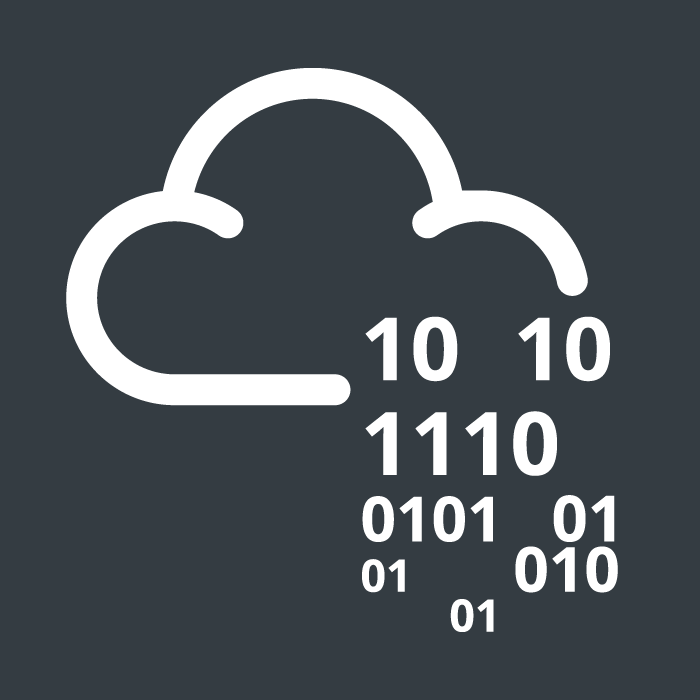

# Bienvenido a mi blog
* * *
 

   

## Hackthebox Machines
 
Puedes ver las maquinas de _**Hackthebox**_ que he resuelto [aqui.](/hackthebox)
   
* * *
 

   

## Tryhackme Machines
 
Puedes ver las maquinas de _**Tryhackme**_ que he resuelto [aqui.](/tryhackme)
   
* * *

#### Puedes ver todas las publicaciones [aqui.](./blog)
 

